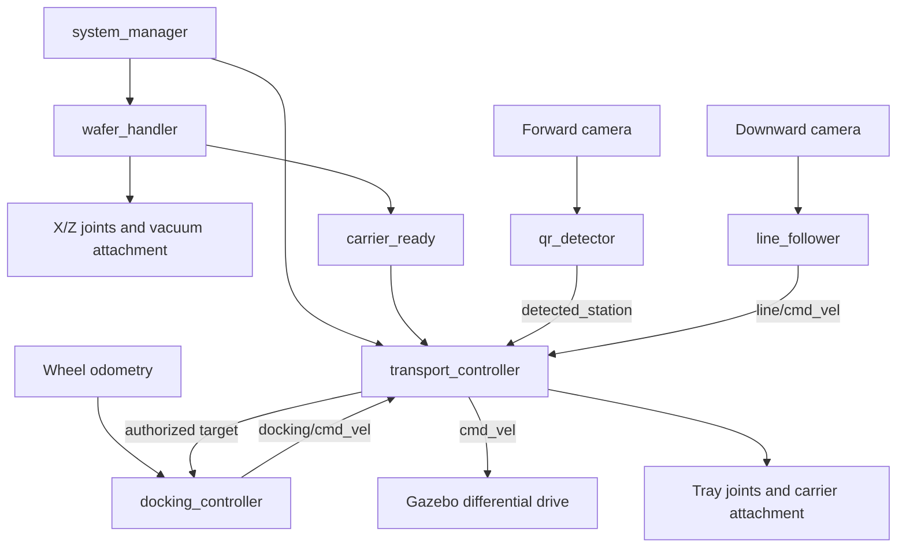

# Wafer handling and transport simulation

A ROS 2 Lyrical / Gazebo Jetty demonstration of two coordinated mechanisms:
an X/Z vacuum gantry inside a cleanroom enclosure and a camera-guided mobile
robot that delivers a wafer carrier to a QR-identified process station.

**Validation status:** Python, controller, image-processing, and asset checks
have been run on macOS. Gazebo physics, ROS/DDS integration, rendered-camera
recognition, and GUI operation have **not** been run here: this development
machine has no ROS or Gazebo installation. All 42 local tests pass and cover
QR decoding at projected camera angles, controller state sequences, and fault
stops, plus installer ordering and failure handling with mocked system commands.
These checks do not validate Python 3.14, Lyrical, or Jetty at runtime. The Ubuntu
verification runner below measures those behaviors and records failures instead
of assuming success.

## Requirements and installation

Use Ubuntu 26.04 (amd64 or arm64), Python 3.14, ROS 2 Lyrical, and Gazebo Jetty
(gz-sim 10). A desktop or VM needs working Ogre2/OpenGL rendering; headless cameras
still require an EGL-capable graphics driver. There is no Gazebo Classic dependency.
The [official Gazebo pairing guide](https://gazebosim.org/docs/jetty/ros_installation/)
recommends Lyrical with Jetty; `ros-lyrical-ros-gz` installs that pairing through ROS
vendor packages without requiring a separate OSRF repository.

The project now targets the existing Ubuntu 26.04 ARM64 VM. Keep that VM;
there is no need to install Ubuntu 24.04. The previous Jazzy installation commands
have been replaced with Lyrical commands and the correct `resolute` repository.

Copy the updated repository into the VM. From its root, run:

```bash
bash wafer_transport_sim/scripts/install_ubuntu.sh
```

The installer checks Ubuntu version and architecture before changing packages,
installs `curl` before downloading anything, configures the native ROS repository,
installs dependencies, and initializes rosdep if needed. It stops on failure so
an HTTP error cannot cascade into JSON and missing-package errors. Rerunning it
is supported. Run it as your normal user; it uses `sudo` for system changes.

For manual setup, these are the same commands. Paste the entire block into the VM
terminal; the subshell stops at the first failure:

```bash
(
set -euo pipefail
source /etc/os-release
if [[ "$ID" != ubuntu || "$VERSION_ID" != 26.04 || "$VERSION_CODENAME" != resolute ]]; then
  echo 'These commands require Ubuntu 26.04 (Resolute).' >&2
  exit 1
fi
sudo apt-get update
sudo apt-get install -y curl ca-certificates python3 locales software-properties-common
sudo locale-gen en_US.UTF-8
sudo update-locale LANG=en_US.UTF-8 LC_ALL=en_US.UTF-8
export LANG=en_US.UTF-8
export LC_ALL=en_US.UTF-8
sudo add-apt-repository -y universe
wafer_setup_tmp=$(mktemp -d)
trap 'rm -rf -- "$wafer_setup_tmp"' EXIT
curl -fsSL --retry 3 -o "$wafer_setup_tmp/release.json" https://api.github.com/repos/ros-infrastructure/ros-apt-source/releases/latest
wafer_ros_source_version=$(python3 -c 'import json,sys; print(json.load(open(sys.argv[1]))["tag_name"])' "$wafer_setup_tmp/release.json")
curl -fL --retry 3 -o "$wafer_setup_tmp/ros2-apt-source.deb" "https://github.com/ros-infrastructure/ros-apt-source/releases/download/${wafer_ros_source_version}/ros2-apt-source_${wafer_ros_source_version}.resolute_all.deb"
sudo dpkg -i "$wafer_setup_tmp/ros2-apt-source.deb"
sudo apt-get update
sudo apt-get install -y \
  ros-lyrical-desktop ros-lyrical-ros-gz ros-lyrical-cv-bridge \
  ros-lyrical-rqt-graph ros-lyrical-rqt-image-view ros-dev-tools \
  python3-pytest python3-opencv python3-numpy python3-yaml \
  python3-qrcode python3-pil python3-setuptools
)
```

Then initialize rosdep if you used manual setup (the installer already does this):

```bash
source /opt/ros/lyrical/setup.bash
if [ ! -f /etc/ros/rosdep/sources.list.d/20-default.list ]; then
  sudo rosdep init
fi
rosdep update --rosdistro lyrical
```

The manifest declares rclpy, rcl_interfaces, ament_index_python, launch, launch_ros,
geometry_msgs, sensor_msgs, nav_msgs, std_msgs, rosgraph_msgs, ros_gz_sim,
ros_gz_bridge, and cv_bridge. `ros-dev-tools` supplies colcon and rosdep. Use the
Ubuntu OpenCV and cv_bridge packages together; do not install pip OpenCV over the
VM's ROS Python environment. Repository setup follows the
[official Lyrical installation instructions](https://docs.ros.org/en/lyrical/Installation/Ubuntu-Install-Debs.html).

## Build and run

Copy or clone this repository onto the Ubuntu machine, then use its root as the
colcon workspace. The package is the `wafer_transport_sim/` subdirectory; colcon
finds it without a separate `src/` directory.

```bash
cd ~/Wafer-Transport-Demo
source /opt/ros/lyrical/setup.bash
rosdep install --from-paths wafer_transport_sim --ignore-src -r -y --rosdistro lyrical
colcon build --symlink-install --packages-select wafer_transport_sim
source install/setup.bash
ros2 launch wafer_transport_sim demo.launch.py
```

If this checkout was previously built under Jazzy, use a fresh build directory:

```bash
colcon --log-base log-lyrical build --build-base build-lyrical --install-base install-lyrical --symlink-install
source install-lyrical/setup.bash
```

The launch starts Gazebo, its world and all five included models, the bridge,
and six application nodes. There are seven installed Python executables: the six
application nodes and the separate `integration_check` runner. Model includes
load exactly once; there is no second spawning path or external asset download.

Gazebo starts running automatically. The manager waits for clock, cameras,
odometry, joint feedback, model poses, and attachment initialization before
starting the visible sequence. Ctrl-C stops the launch. Relaunch for another
mission; in-place world reset is not supported.

```bash
# Select another station at launch.
ros2 launch wafer_transport_sim demo.launch.py destination_station:=STATION_B

# Headless mode still renders the cameras using Ogre2/EGL.
ros2 launch wafer_transport_sim demo.launch.py gui:=false

# Supply an edited copy of the parameter configuration.
ros2 launch wafer_transport_sim demo.launch.py config:=/absolute/path/simulation.yaml

# Before transport starts, a live destination update is also supported.
ros2 param set /transport_controller destination_station STATION_C
```

Destination defaults to `STATION_C` in the YAML file. The launch argument, if
provided, overrides it. The controller validates and latches the destination in
`READ_DESTINATION`; later changes are rejected with a reason. Unknown station IDs
are rejected. Structural parameters such as station positions should be edited
in the configuration before launch, with corresponding model changes.

## Dimensions and layout

| Region | Feet | Metres |
|---|---|---|
| Internal enclosure | 4 × 3 × 4 | 1.2192 × 0.9144 × 1.2192 |
| External corridor | 1 × 4 × 4 | 0.3048 × 1.2192 × 1.2192 |

World X spans the enclosure width, 0–0.9144 m, followed by the corridor,
0.9144–1.2192 m. World Y spans 0–1.2192 m along both regions. Their combined floor
is 1.2192 m square. The enclosure has transparent front/dividing panels, a loading
opening, structural posts, dimensional signs, and simple process equipment.
The corridor is open for viewing; its designated height is 1.2192 m.

The robot starts at world `(1.025, 0.12, 0)` facing +Y. Its chassis is 0.18 × 0.12 m,
with wheels spanning about 0.154 m. The forward and downward cameras extend beyond
the chassis. Wheel odometry starts at `(0, 0, 0)`; odom +X is forward along world
+Y, and odom +Y points toward world −X.

| QR payload | Process | Dock world Y | Dock odom X |
|---|---|---:|---:|
| STATION_A | LOAD | 0.40 m | 0.28 m |
| STATION_B | SPIN_COAT | 0.72 m | 0.60 m |
| STATION_C | BAKE | 1.04 m | 0.92 m |

The demonstration wafer is 100 mm in diameter, inside a 130 mm square carrier.
This scale fits the specified corridor; it is not a full-size 300 mm wafer system.

## Architecture



`transport_controller` is the **only publisher of `/cmd_vel`**. Candidate commands
from line following and docking cannot race each other. Stationary and fault
states override both with zero velocity.

### Wafer handling

```text
IDLE → HOME → MOVE_TO_WAFER → LOWER_WAND → VACUUM_ON → VERIFY_VACUUM
→ LIFT_PICKUP → MOVE_TO_BOX → LOWER → VACUUM_OFF → LIFT_RETRACT
→ TRANSFER_COMPLETE
```

The two explicit `LIFT` phases have distinct names so logs and tests can distinguish
them. Joint feedback, attachment state, and wafer pose gate transitions; elapsed
time alone never marks a move successful. The stock detachable-joint plugin starts
attached, so initialization releases the wafer onto the process output before
homing. A small wand/wafer gap avoids reattachment during collision. Vacuum pickup
then joins the wafer to the wand at their current relative pose. Lifting verifies
that the wafer actually rises.

The carrier starts on the docked robot and is supported by loading rails during
its initialization handshake. The gantry deposits the wafer into its open
clamshell-style tray and retracts. Only then does `/carrier_ready` become true.
No `set_pose` calls or teleportation are used.

### Path following and QR recognition

The downward camera supplies BGR images. `line_follower` crops the lower image,
converts to grayscale, thresholds the dark stripe, selects a sufficiently long
connected component, and finds its centroid:

```text
error = line_center_x - image_center_x
angular_z = clamp(-kp * error, -max_angular_speed, max_angular_speed)
```

Defaults are 0.035 m/s, `kp=0.004`, angular limit 0.6 rad/s, threshold 55, and crop
ratio 0.35. Missing images, an all-dark image, or no valid stripe cannot produce a
valid forward command. The robot's trajectory is not scripted with waypoints.

The forward camera supplies 960 × 720 RGB images at 20 Hz. OpenCV
`QRCodeDetector.detectAndDecodeMulti` reads the genuine textured QR panels.
Three consecutive detections and a minimum 70-pixel decoded-square side are
required. The size gate excludes distant, poorly resolved signs; each station
has its own confirmation counter. Confirmed IDs are republished while visible,
so a QR observed during wafer loading can still be recognized after departure.
Station coordinates are never used to synthesize QR detections or to steer from
the codes.

Textures are committed. To regenerate all models, world geometry, and textures:

```bash
python3 wafer_transport_sim/scripts/generate_assets.py
```

### Transport and docking

```text
WAIT_FOR_CARRIER → VERIFY_CARRIER → READ_DESTINATION → START_TRANSPORT
→ FOLLOW_PATH → SCAN_QR → IS_TARGET_QR
    non-target → CONTINUE → FOLLOW_PATH
    target → SLOW_APPROACH → PRECISION_DOCK → STOP
           → DROP_CARRIER → VERIFY_DROP → DELIVERY_COMPLETE
```

The tray first lifts 4 mm clear of the loading rails. Line following handles
normal motion. A matching QR authorizes the docking controller, which computes
remaining distance from wheel odometry and the station's configured docking pose.
It commands at most 0.018 m/s, enters precision docking through the final 0.10 m,
and reduces speed proportionally near the target. `/docking_distance` is remaining
signed longitudinal distance in metres, **not a physical ToF measurement**.

Default stop tolerance is 0.01 m, with measured speed below 0.004 m/s, angular speed
below 0.02 rad/s, lateral error below 0.012 m, and heading error below 0.05 rad.
Change `position_tolerance` consistently in both controller YAML sections.
A QR entering the frame cannot by itself declare docking complete.

### Supported carrier delivery

At a verified stop, the tray extends 0.12 m laterally, lowers the carrier onto two
shelf rails, and releases the carrier's fixed attachment. It lowers another 10 mm
to clear the carrier, then retracts between the rails. Carrier and wafer poses
must remain inside the station acceptance region for one simulated second before
`/carrier_delivered` becomes true. The exposed wafer is never separately dropped
at the process station.

The tray is an idealized, collision-free fork visual whose detachable joint
carries the load. Shelf rails, carrier base/rim, wafer, chassis, wheels, and gantry
have physical collision geometry. The fork simplification avoids Jetty's
parent/child contact restriction on reattachment. The wafer stays inside its
carrier through gravity, friction, and the protective rim rather than a second
joint that could create a closed attachment chain. See
[Jetty detachable joints](https://gazebosim.org/api/sim/10/detachablejoints.html).

### Timing and failures

All application nodes use `/clock`. Readiness and completion flags and state
strings use reliable transient-local QoS. Images use sensor-compatible QoS.
Attachment state is event-based, so its last acknowledgement is retained rather
than treated as a periodic sensor heartbeat; model poses provide continuing
retention checks.

Stale required feedback, missing stripe, lost payload, attachment failure, missed
destination, and move/delivery timeouts enter `FAULT`, publish `/system/fault`,
command zero wheel velocity, and hold available actuator positions. Startup has a
90-second wall-clock timeout, allowing a missing simulator to be reported even
without `/clock`. State deadlines are 30 simulated seconds and the transport
mission deadline is 120 simulated seconds. A paused simulator pauses these
motion deadlines. Relaunch after resolving a fault.

## ROS topics

| Topic | ROS message | Purpose |
|---|---|---|
| `/clock` | rosgraph_msgs/Clock | Gazebo simulation time |
| `/cmd_vel` | geometry_msgs/Twist | Sole robot command output |
| `/odom` | nav_msgs/Odometry | Wheel odometry |
| `/camera/image_raw` | sensor_msgs/Image | Forward QR camera |
| `/down_camera/image_raw` | sensor_msgs/Image | Path camera |
| `/detected_station` | std_msgs/String | Confirmed QR payload |
| `/carrier_ready` | std_msgs/Bool | Loading and retraction complete |
| `/carrier_present` | std_msgs/Bool | Carrier attachment acknowledged |
| `/carrier_delivered` | std_msgs/Bool | Supported delivery verified |
| `/docking_distance` | std_msgs/Float64 | Signed remaining distance |
| `/wafer_handler/state`, `/transport/state`, `/system/state` | std_msgs/String | Current states |
| `/system/fault` | std_msgs/String | Fault reason |
| `/system/start`, `/system/transport_enable` | std_msgs/Bool | Sequencing interlocks |
| `/line/cmd_vel`, `/docking/cmd_vel` | geometry_msgs/Twist | Candidate commands |
| `/line/valid`, `/qr/healthy`, `/docking/reached` | std_msgs/Bool | Processing/position checks |
| `/docking/target` | std_msgs/String | Authorized destination |
| `/gantry/joint_states`, `/robot/joint_states` | sensor_msgs/JointState | Actuator feedback |
| `/actuators/{gantry_x,gantry_z,tray_y,tray_z}` | std_msgs/Float64 | Joint position targets |
| `/attachments/{vacuum,carrier}/{attach,detach}` | std_msgs/Empty | Attachment commands |
| `/attachments/{vacuum,carrier}/state` | std_msgs/String | `attached` / `detached` acknowledgement |
| `/poses/{wafer,carrier}` | geometry_msgs/PoseStamped | Simulation model pose evidence |

The explicit unidirectional bridge mappings are in `config/bridge.yaml`.
Jetty systems use `gz-sim-…-system` filenames and `gz::sim::systems::…` classes.
The [Lyrical bridge mappings](https://github.com/gazebosim/ros_gz/blob/lyrical/ros_gz_bridge/README.md)
cover the message conversions used here.

```bash
ros2 topic list
ros2 topic echo /cmd_vel
ros2 topic echo /detected_station
ros2 topic echo /transport/state
ros2 topic echo /wafer_handler/state
ros2 topic echo /odom
ros2 topic echo /system/fault
ros2 topic hz /camera/image_raw
ros2 topic hz /down_camera/image_raw
ros2 topic info /cmd_vel --verbose
rqt_graph
ros2 run rqt_image_view rqt_image_view /camera/image_raw
```

## Expected console and visual sequence

Representative application messages, excluding ROS/Gazebo startup prefixes:

```text
[Transport] Waiting for wafer carrier
[WaferHandler] Homing gantry
[WaferHandler] Moving to wafer
[WaferHandler] Lowering vacuum wand
[WaferHandler] Vacuum enabled
[WaferHandler] Wafer pickup verified
[WaferHandler] Lifting wafer
[WaferHandler] Moving to carrier
[WaferHandler] Lowering wafer into carrier
[WaferHandler] Vacuum released
[WaferHandler] Lifting wafer wand clear of carrier
[WaferHandler] Transfer complete
[Transport] Carrier detected
[Transport] Destination: STATION_C
[Transport] Beginning transport; following corridor
[Transport] QR detected: STATION_A
[Transport] Station does not match destination
[Transport] Continuing transport
[Transport] QR detected: STATION_B
[Transport] Station does not match destination
[Transport] Continuing transport
[Transport] QR detected: STATION_C
[Transport] Destination confirmed; slowing for docking
[Transport] Docking
[Transport] Position reached
[Transport] Carrier delivered; mission complete
TRANSPORT COMPLETE
```

Visually, the wand retracts and homes, traverses to the process output, lowers,
picks up the silicon disc, lifts it, traverses to the carrier, lowers and releases
it, then retracts. The robot raises its carrier clear of the loading support,
follows the floor stripe past non-target stations, slows toward the chosen station,
stops, extends and lowers its transfer tray, releases the carrier onto the rails,
and retracts. The carrier and wafer remain on the shelf. QR observation order can
vary with visibility; it must never cause delivery at a non-target station.

## Verification

Portable checks (also run by colcon):

```bash
PYTHONPATH=wafer_transport_sim python3 -m pytest wafer_transport_sim/test -q
colcon test --packages-select wafer_transport_sim
colcon test-result --verbose
```

On Ubuntu, after building and sourcing the workspace, run the complete integration
suite with **no other demo instance running**:

```bash
bash wafer_transport_sim/scripts/verify_ubuntu.sh
```

It validates SDF with `gz sdf -k`, launches separate A/B/C missions, then injects
missing images, lost stripe, blocked vacuum attachment, and absent target QR.
Each scenario starts and stops its own headless launch. Reports and simulator logs
are written under `log/integration/`. The nominal runs require decoded camera QR,
ordered handling states, zero premature motion, ≤10 mm docking error, and the
carrier and wafer still at the shelf after completion. Failure runs require a
fault, fresh zero commands, and no false delivery success.

```bash
# One scenario; this command launches its own simulator.
ros2 run wafer_transport_sim integration_check --destination STATION_C
ros2 run wafer_transport_sim integration_check --scenario failed_pickup
```

The image relay used for failure injection exists only in the integration runner.
It forwards actual rendered images for nominal tests. The `bridge_config` launch
argument lets the runner route images through this relay and disable vacuum attach
commands in the failed-pickup test. Production launch has no injected sensor data.

The local controller tests execute actual controller methods against an in-memory
ROS API substitute. They validate logical sequencing and faults, not real DDS,
Gazebo plugins, collision behavior, or rendered image quality. A separate GUI
inspection remains necessary to assess animation and presentation.

## Troubleshooting and limitations

| Symptom | Check |
|---|---|
| Package not found | Source both `/opt/ros/lyrical/setup.bash` and `install/setup.bash`. |
| Missing plugin | Confirm `ros-lyrical-ros-gz` is installed and `gz sim --versions` includes version 10. |
| No images / startup timeout | Inspect Gazebo Ogre2/EGL errors, graphics acceleration, `/clock`, and both camera topics. |
| Blank QR signs | Check installed `textures/`, `GZ_SIM_RESOURCE_PATH`, and PBR texture paths. |
| QR never accepted | Inspect forward image, sign visibility, and `minimum_qr_side_pixels`; do not replace camera decoding with station coordinates. |
| Lost line | Inspect downward image; tune threshold/crop and lighting. Blank/dark frames intentionally stop transport. |
| Vacuum timeout | Inspect `/attachments/vacuum/state`, `/poses/wafer`, and joint feedback. No motion state may be skipped to bypass a fault. |
| Delivery timeout | Inspect carrier pose, tray feedback, shelf alignment, and wafer retention. |
| Bridge topic absent | Compare `gz topic -l` with `ros2 topic list` and `bridge.yaml`. |
| Slow VM | Enable 3D acceleration; allow more integration wall time with `--timeout`. Motion timeouts use simulation time. |
| ROS packages not found | Run `install_ubuntu.sh` to add the Resolute ROS repository; installing curl alone does not add it. |
| Apt dependencies conflict | Ensure Ubuntu `resolute-updates` and `resolute-backports` repositories are enabled. |

This is a single-mission, scaled simulation. It has no vacuum fluid model, carrier
lid actuation, IMU, obstacle avoidance, Nav2, automatic return trip, or physical
ToF sensor. Docking uses ideal wheel odometry from a known starting pose, while
placement verification uses Gazebo model poses. Real hardware would require
localization, independent payload sensing, and a safety controller. The 10 mm
stopping target is configurable and tested logically here; its achieved physical
accuracy remains unmeasured until the Ubuntu integration suite is run.

## Project tree

```text
Wafer-Transport-Demo/
├── README.md
├── LICENSE
├── .gitignore
└── wafer_transport_sim/
    ├── package.xml
    ├── setup.py
    ├── setup.cfg
    ├── resource/wafer_transport_sim
    ├── launch/demo.launch.py
    ├── worlds/wafer_transport.sdf
    ├── models/
    │   ├── wafer/{model.config,model.sdf}
    │   ├── carrier/{model.config,model.sdf}
    │   ├── gantry/{model.config,model.sdf}
    │   ├── transport_robot/{model.config,model.sdf}
    │   └── stations/{model.config,model.sdf}
    ├── config/{bridge.yaml,simulation.yaml}
    ├── textures/
    │   ├── station_{a,b,c}_qr.png
    │   ├── station_{a,b,c}_label.png
    │   └── {enclosure,corridor}_label.png
    ├── scripts/{install_ubuntu.sh,generate_assets.py,verify_ubuntu.sh}
    ├── test/{test_assets.py,test_core.py,test_vision.py,test_controllers.py,test_installer.py}
    └── wafer_transport_sim/
        ├── __init__.py
        ├── common.py
        ├── core.py
        ├── vision.py
        ├── system_manager.py
        ├── wafer_handler.py
        ├── line_follower.py
        ├── qr_detector.py
        ├── transport_controller.py
        ├── docking_controller.py
        └── integration_check.py
```
