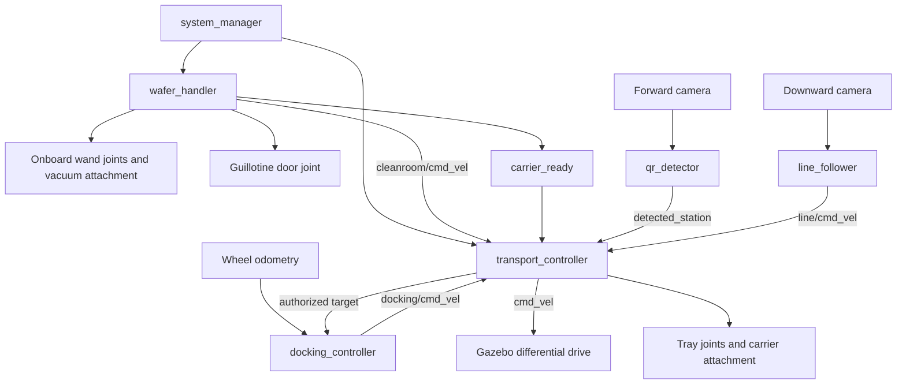

> Legacy single-room demonstration. The default launch now uses the four-room loop; see [the current README](../README.md).

# Wafer handling and transport simulation

A ROS 2 Lyrical / Gazebo Jetty demonstration of a mobile wafer-handling robot.
The robot enters a Class 100 room through a powered guillotine door and follows
black floor tape to the pickup position. Its onboard telescoping vacuum wand
loads the carrier. The robot then returns to the corridor and delivers the
carrier to a camera-recognized QR station. There is no stationary gantry.

**Validation status:** Python, controller, image-processing, and asset checks
have been run on macOS. Gazebo physics, ROS/DDS integration, rendered-camera
recognition, and GUI operation have **not** been run here: this development
machine has no ROS or Gazebo installation. All 84 local tests pass and cover
QR decoding at projected camera angles, door clearance, mobile pickup, exit
recovery with biased wheel odometry, command
arbitration, projected visibility of the room tape, and fault stops, plus installer
ordering and failure handling with mocked system commands.
These checks do not validate Python 3.14, Lyrical, or Jetty at runtime. The Ubuntu
verification runner below measures those behaviors and records failures instead
of assuming success.

## Requirements and installation

Use Ubuntu 26.04 (amd64 or arm64), Python 3.14, ROS 2 Lyrical, and Gazebo Jetty
(gz-sim 10). A desktop or VM needs working Ogre2/OpenGL rendering; headless cameras
still require an EGL-capable graphics driver. There is no Gazebo Classic dependency.
The [official Gazebo pairing guide](https://gazebosim.org/docs/jetty/ros_installation/)
recommends Lyrical with Jetty; `ros-lyrical-ros-gz` installs that pairing through ROS
vendor packages without requiring a separate OSRF repository.

The project now targets the existing Ubuntu 26.04 ARM64 VM. Keep that VM;
there is no need to install Ubuntu 24.04. The previous Jazzy installation commands
have been replaced with Lyrical commands and the correct `resolute` repository.

Copy the updated repository into the VM. From its root, run:

```bash
bash wafer_transport_sim/scripts/install_ubuntu.sh
```

The installer checks Ubuntu version and architecture before changing packages,
installs `curl` before downloading anything, configures the native ROS repository,
installs dependencies, and initializes rosdep if needed. It stops on failure so
an HTTP error cannot cascade into JSON and missing-package errors. Rerunning it
is supported. Run it as your normal user; it uses `sudo` for system changes.

For manual setup, these are the same commands. Paste the entire block into the VM
terminal; the subshell stops at the first failure:

```bash
(
set -euo pipefail
source /etc/os-release
if [[ "$ID" != ubuntu || "$VERSION_ID" != 26.04 || "$VERSION_CODENAME" != resolute ]]; then
  echo 'These commands require Ubuntu 26.04 (Resolute).' >&2
  exit 1
fi
sudo apt-get update
sudo apt-get install -y curl ca-certificates python3 locales software-properties-common
sudo locale-gen en_US.UTF-8
sudo update-locale LANG=en_US.UTF-8 LC_ALL=en_US.UTF-8
export LANG=en_US.UTF-8
export LC_ALL=en_US.UTF-8
sudo add-apt-repository -y universe
wafer_setup_tmp=$(mktemp -d)
trap 'rm -rf -- "$wafer_setup_tmp"' EXIT
curl -fsSL --retry 3 -o "$wafer_setup_tmp/release.json" https://api.github.com/repos/ros-infrastructure/ros-apt-source/releases/latest
wafer_ros_source_version=$(python3 -c 'import json,sys; print(json.load(open(sys.argv[1]))["tag_name"])' "$wafer_setup_tmp/release.json")
curl -fL --retry 3 -o "$wafer_setup_tmp/ros2-apt-source.deb" "https://github.com/ros-infrastructure/ros-apt-source/releases/download/${wafer_ros_source_version}/ros2-apt-source_${wafer_ros_source_version}.resolute_all.deb"
sudo dpkg -i "$wafer_setup_tmp/ros2-apt-source.deb"
sudo apt-get update
sudo apt-get install -y \
  ros-lyrical-desktop ros-lyrical-ros-gz ros-lyrical-cv-bridge \
  ros-lyrical-rqt-graph ros-lyrical-rqt-image-view ros-dev-tools \
  python3-pytest python3-opencv python3-numpy python3-yaml \
  python3-qrcode python3-pil python3-setuptools
)
```

Then initialize rosdep if you used manual setup (the installer already does this):

```bash
source /opt/ros/lyrical/setup.bash
if [ ! -f /etc/ros/rosdep/sources.list.d/20-default.list ]; then
  sudo rosdep init
fi
rosdep update --rosdistro lyrical
```

The manifest declares rclpy, rcl_interfaces, ament_index_python, launch, launch_ros,
geometry_msgs, sensor_msgs, nav_msgs, std_msgs, rosgraph_msgs, ros_gz_sim,
ros_gz_bridge, and cv_bridge. `ros-dev-tools` supplies colcon and rosdep. Use the
Ubuntu OpenCV and cv_bridge packages together; do not install pip OpenCV over the
VM's ROS Python environment. Repository setup follows the
[official Lyrical installation instructions](https://docs.ros.org/en/lyrical/Installation/Ubuntu-Install-Debs.html).

## Build and run

Copy or clone this repository onto the Ubuntu machine, then use its root as the
colcon workspace. The package is the `wafer_transport_sim/` subdirectory; colcon
finds it without a separate `src/` directory.

```bash
cd ~/Wafer-Transport-Demo
source /opt/ros/lyrical/setup.bash
rosdep install --from-paths wafer_transport_sim --ignore-src -r -y --rosdistro lyrical
colcon build --symlink-install --packages-select wafer_transport_sim
source install/setup.bash
ros2 launch wafer_transport_sim demo.launch.py layout:=single_room
```

For an existing UTM installation, stop the old demo with **Ctrl-C**. The refreshed
`dist/wafer-transport-ubuntu26.04.zip` on the Mac contains this version. If UTM
shares that `dist` folder at `/mnt/utm`, extract into a fresh workspace so obsolete
models and previous build artifacts cannot be selected:

```bash
mkdir -p ~/wafer-mobile-update
unzip -o /mnt/utm/wafer-transport-ubuntu26.04.zip -d ~/wafer-mobile-update
cd ~/wafer-mobile-update/Wafer-Transport-Demo
source /opt/ros/lyrical/setup.bash
colcon build --symlink-install --packages-select wafer_transport_sim
source install/setup.bash
ros2 launch wafer_transport_sim demo.launch.py layout:=single_room
```

If this checkout was previously built under Jazzy, use a fresh build directory:

```bash
colcon --log-base log-lyrical build --build-base build-lyrical --install-base install-lyrical --symlink-install
source install-lyrical/setup.bash
```

The launch starts Gazebo, its world and all five included models, the bridge,
and six application nodes. There are seven installed Python executables: the six
application nodes and the separate `integration_check` runner. Model includes
load exactly once; there is no second spawning path or external asset download.

Gazebo starts running automatically. The manager waits for clock, cameras,
odometry, joint feedback, model poses, and attachment initialization before
starting the visible sequence. While waiting, it prints `[Startup] Waiting for:`
with specific missing topics or unsatisfied checks every two wall-clock seconds.
During pickup, `[Pickup]` reports the handler state, measured actuator positions,
the ROS door target, and tape detection. The previous command echo reported
missing data despite measured motion, so it has been removed; joint feedback
remains the evidence that the door is moving.
The latched `/system/readiness` topic carries the startup details.
Ctrl-C stops the launch. Relaunch for another
mission; in-place world reset is not supported.

```bash
# Select another station at launch.
ros2 launch wafer_transport_sim demo.launch.py layout:=single_room destination_station:=STATION_B

# Headless mode still renders the cameras using Ogre2/EGL.
ros2 launch wafer_transport_sim demo.launch.py layout:=single_room gui:=false

# Supply an edited copy of the parameter configuration.
ros2 launch wafer_transport_sim demo.launch.py layout:=single_room config:=/absolute/path/simulation.yaml

# Before transport starts, a live destination update is also supported.
ros2 param set /transport_controller destination_station STATION_C
```

Destination defaults to `STATION_C` in the YAML file. The launch argument, if
provided, overrides it.

Cruising speed is 0.06 m/s, turning speed is capped at 0.55 rad/s, and wand/tray
joints are capped at 0.10 m/s. The door target ramps at 0.10 m/s. Speeds decrease
near stop positions; feedback and low-velocity checks still gate every handoff.
The `wafer_handler` YAML section exposes `room_speed`, `turn_speed`, and
`door_speed`; `line_follower.linear_speed` sets the corridor cruise speed.
Precision docking remains limited to 0.018 m/s.

The controller validates and latches the destination in
`READ_DESTINATION`; later changes are rejected with a reason. Unknown station IDs
are rejected. Structural parameters such as station positions should be edited
in the configuration before launch, with corresponding model changes.

## Dimensions and layout

| Region | Feet | Metres |
|---|---|---|
| Internal enclosure | 4 × 3 × 4 | 1.2192 × 0.9144 × 1.2192 |
| External corridor | 1 × 4 × 4 | 0.3048 × 1.2192 × 1.2192 |

World X spans the enclosure width, 0–0.9144 m, followed by the corridor,
0.9144–1.2192 m. World Y spans 0–1.2192 m along both regions. Their combined floor
is 1.2192 m square. The enclosure has transparent front/dividing panels, a loading
robot doorway, structural posts, dimensional signs, and simple process equipment.
The door panel slides vertically through 0.52 m. Its position target ramps at
0.10 m/s (about 5.2 simulated seconds per full stroke). A force-based position
controller balances panel weight with a 3.924 N offset and limits drive force
to ±20 N. The operating positions lie inside the mechanical joint limits. Its guides and offset fixed
header leave a passage for the robot with its wand stowed. “Class 100” is a room
label and operating sequence; air filtration and particle counts are not modeled.
The corridor is open for viewing; its designated height is 1.2192 m.

The robot starts at world `(1.025, 0.12, 0)` facing +Y. Its chassis is 0.18 × 0.12 m,
with wheels spanning about 0.154 m. The forward and downward cameras extend beyond
the chassis. Wheel odometry starts at `(0, 0, 0)`; odom +X is forward along world
+Y, and odom +Y points toward world −X.

| QR payload | Process | Dock world Y | Dock odom X |
|---|---|---:|---:|
| STATION_A | LOAD | 0.40 m | 0.28 m |
| STATION_B | SPIN_COAT | 0.72 m | 0.60 m |
| STATION_C | BAKE | 1.04 m | 0.92 m |

The demonstration wafer is 100 mm in diameter, inside a 130 mm square carrier.
This scale fits the specified corridor; it is not a full-size 300 mm wafer system.

## Architecture



`transport_controller` is the **only publisher of `/cmd_vel`**. Candidate commands
from room navigation, line following, and docking are selected by mission phase.
Before loading, only the authorized room-entry/exit maneuvers can command wheels.
Pickup, door actuation, and fault states command zero wheel velocity.

### Wafer handling

```text
IDLE → HOME → OPEN_ENTRY → TURN_IN → ENTER_ROOM → CLOSE_ENTRY
→ MOVE_TO_WAFER → LOWER_WAND → VACUUM_ON → VERIFY_VACUUM
→ LIFT_PICKUP → MOVE_TO_BOX → LOWER → VACUUM_OFF → LIFT_RETRACT
→ OPEN_EXIT → ALIGN_EXIT → EXIT_ROOM → TURN_OUT → CLOSE_EXIT
→ VERIFY_EXIT → TRANSFER_COMPLETE
```

An 18 mm black tape branch connects the corridor to the pickup approach through
the doorway, along world Y = 0.12 m and X = 0.50–1.08 m. It remains under the
forward-offset downward camera when the robot stops at X = 0.65 m.

The carrier attachment is initialized while supported on the loading rails.
`HOME` raises the tray 4 mm clear of those rails and checks the wand is stowed.
The guillotine door must report its fully open position before wheel motion.
The robot turns to face −world X, stops to acquire the tape, then uses downward-camera
centroid steering to follow it to `(0.65, 0.12)`. Pose feedback limits speed near
the stop and checks doorway clearance; it does not provide entry steering. After it stops
fully inside, the door closes; pickup requires measured closure and zero motion.

The robot's wand has a Z lift and three nested horizontal prismatic stages
(`reach_1`, `reach_2`, `wand_x`), each extending one third of the 0.25 m reach.
The tip lowers to the process output at `(0.4, 0.12)`, attaches the wafer, lifts,
retracts over the onboard carrier, lowers, releases, and retracts vertically.
The two `LIFT` phases have distinct names. Joint feedback, attachment
acknowledgements, and actual wafer position gate every step.

The stock detachable-joint plugin starts attached, so initialization releases the
wafer onto the process output before motion. A small wand/wafer gap avoids
reattachment while those bodies are touching. Pickup joins the wafer to the wand
at their current relative pose; measured lift verifies the wafer actually rises.
Wand and tray joints use speed-limited velocity control; the door uses force-based
PD control with gravity compensation and a ramped target. These use the
[Jetty JointPositionController interface](https://gazebosim.org/api/sim/10/classgz_1_1sim_1_1systems_1_1JointPositionController.html).

After loading, the door reopens and `ALIGN_EXIT` corrects heading before reverse
motion. Reverse guidance uses the robot's world pose and a lookahead point on the
room centerline; it corrects recoverable heading drift while stopped instead of
faulting at the first exit command. The robot backs into the corridor, turns to
face +Y, and verifies its entire footprint is clear before closing the door.
`VERIFY_EXIT` confirms the outside position, stowed wand, stopped wheels, and
closed door before publishing `/cleanroom/exited=true`. The manager and transport
controller both require this flag before enabling station travel.
`/carrier_ready` becomes true only after this entire sequence. The manager then
enables station transport. During closure, the robot must be stopped and its
oriented footprint, including wand extension, must clear the door plane. An
obstruction, stalled door, stale feedback, or lost payload produces a fault.
No `set_pose` calls or object teleportation are used.

### Path following and QR recognition

The downward camera supplies BGR images. `line_follower` crops the lower image,
converts to grayscale, thresholds the dark stripe, selects a sufficiently long
connected component, and finds its centroid:

```text
error = line_center_x - image_center_x
angular_z = clamp(-kp * error, -max_angular_speed, max_angular_speed)
```

Defaults are 0.06 m/s, `kp=0.004`, angular limit 0.6 rad/s, threshold 55, and crop
ratio 0.35. Missing images, an all-dark image, or no valid stripe cannot produce a
valid forward command. Corridor travel follows the camera stripe; the short
turning and reverse-exit maneuvers use known room geometry and world pose for
steering; wheel odometry supplies measured speed. This keeps heading calculations
in one coordinate frame during room maneuvers.
Forward entry follows the room tape using the same image-processing pipeline as
the corridor. Lost tape or stale image/steering feedback stops entry and faults
the mission. Turns wait for tape reacquisition before starting entry.

The forward camera supplies 960 × 720 RGB images at 8 Hz; the downward camera remains at 20 Hz. OpenCV
`QRCodeDetector.detectAndDecodeMulti` reads the genuine textured QR panels.
Three consecutive detections and a minimum 70-pixel decoded-square side are
required. The size gate excludes distant, poorly resolved signs; each station
has its own confirmation counter. Confirmed IDs are republished while visible,
so a QR observed during wafer loading can still be recognized after departure.
Station coordinates are never used to synthesize QR detections or to steer from
the codes.

Textures are committed. To regenerate all models, world geometry, and textures:

```bash
python3 wafer_transport_sim/scripts/generate_assets.py
```

### Transport and docking

```text
WAIT_FOR_CARRIER → VERIFY_CARRIER → READ_DESTINATION → START_TRANSPORT
→ FOLLOW_PATH → SCAN_QR → IS_TARGET_QR
    non-target → CONTINUE → FOLLOW_PATH
    target → SLOW_APPROACH → PRECISION_DOCK → STOP
           → DROP_CARRIER → VERIFY_DROP → DELIVERY_COMPLETE
```

The tray already cleared its loading rails before entry. Line following handles
normal corridor motion. A matching QR authorizes the docking controller, which computes
remaining distance from wheel odometry and the station's configured docking pose.
It commands at most 0.018 m/s, enters precision docking through the final 0.10 m,
and reduces speed proportionally near the target. `/docking_distance` is remaining
signed longitudinal distance in metres, **not a physical ToF measurement**.

Default stop tolerance is 0.01 m, with measured speed below 0.004 m/s, angular speed
below 0.02 rad/s, lateral error below 0.012 m, and heading error below 0.05 rad.
Change `position_tolerance` consistently in both controller YAML sections.
A QR entering the frame cannot by itself declare docking complete.

### Supported carrier delivery

At a verified stop, the tray extends 0.12 m laterally, lowers the carrier onto two
shelf rails, and releases the carrier's fixed attachment. It lowers another 10 mm
to clear the carrier, then retracts between the rails. Carrier and wafer poses
must remain inside the station acceptance region for one simulated second before
`/carrier_delivered` becomes true. The exposed wafer is never separately dropped
at the process station.

The tray is an idealized, collision-free fork visual whose detachable joint
carries the load. Shelf rails, carrier base/rim, wafer, chassis, wheels, wand, and door
have physical collision geometry. Nested reach tubes are visual only to avoid
self-contact inside the telescoping mechanism; the cup and mast have collisions.
The fork simplification avoids Jetty's
parent/child contact restriction on reattachment. The wafer stays inside its
carrier through gravity, friction, and the protective rim rather than a second
joint that could create a closed attachment chain. See
[Jetty detachable joints](https://gazebosim.org/api/sim/10/detachablejoints.html).

### Timing and failures

All application nodes use `/clock`. Readiness and completion flags and state
strings use reliable transient-local QoS. Images use sensor-compatible QoS.
Attachment state is event-based, so its last acknowledgement is retained rather
than treated as a periodic sensor heartbeat; model poses provide continuing
retention checks.

During stationary door and wand operations, required feedback is joint state,
odometry, and object/robot pose; camera delays do not cancel those operations.
Wheel motion requires fresh downward-camera health, and forward room entry also
requires a valid tape detection and fresh steering command. Corridor travel
additionally requires forward-camera QR health. Timeout errors identify the
missing topic rather than reporting a generic sensor failure.

Stale required feedback, missing stripe, lost payload, attachment failure, missed
destination, and move/delivery timeouts enter `FAULT`, publish `/system/fault`,
command zero wheel velocity, and hold available actuator positions. Startup has a
90-second wall-clock timeout, allowing a missing simulator to be reported even
without `/clock`. State deadlines are 30 simulated seconds and the transport
mission deadline is 120 simulated seconds. A paused simulator pauses these
motion deadlines. Relaunch after resolving a fault.

## ROS topics

| Topic | ROS message | Purpose |
|---|---|---|
| `/clock` | rosgraph_msgs/Clock | Gazebo simulation time |
| `/cmd_vel` | geometry_msgs/Twist | Sole robot command output |
| `/odom` | nav_msgs/Odometry | Wheel odometry |
| `/camera/image_raw` | sensor_msgs/Image | Forward QR camera |
| `/down_camera/image_raw` | sensor_msgs/Image | Path camera |
| `/detected_station` | std_msgs/String | Confirmed QR payload |
| `/cleanroom/exited` | std_msgs/Bool | Loaded robot verified outside with door closed |
| `/carrier_ready` | std_msgs/Bool | Loaded, exited, wand stowed, door closed |
| `/carrier_present` | std_msgs/Bool | Carrier attachment acknowledged |
| `/carrier_delivered` | std_msgs/Bool | Supported delivery verified |
| `/docking_distance` | std_msgs/Float64 | Signed remaining distance |
| `/wafer_handler/state`, `/transport/state`, `/system/state` | std_msgs/String | Current states |
| `/system/fault` | std_msgs/String | Fault reason |
| `/system/start`, `/system/transport_enable` | std_msgs/Bool | Sequencing interlocks |
| `/cleanroom/cmd_vel`, `/line/cmd_vel`, `/docking/cmd_vel` | geometry_msgs/Twist | Candidate commands |
| `/line/valid`, `/line/healthy`, `/qr/healthy`, `/docking/reached` | std_msgs/Bool | Processing/position checks |
| `/docking/target` | std_msgs/String | Authorized destination |
| `/door/open`, `/door/closed` | std_msgs/Bool | Measured door end positions |
| `/door/joint_states`, `/robot/joint_states` | sensor_msgs/JointState | Actuator feedback |
| `/actuators/{reach_1,reach_2,wand_x,wand_z,door_z,tray_y,tray_z}` | std_msgs/Float64 | Joint position targets |
| `/attachments/{vacuum,carrier}/{attach,detach}` | std_msgs/Empty | Attachment commands |
| `/attachments/{vacuum,carrier}/state` | std_msgs/String | `attached` / `detached` acknowledgement |
| `/poses/{wafer,carrier,transport_robot}` | geometry_msgs/PoseStamped | Simulation model pose evidence |

The explicit unidirectional bridge mappings are in `config/bridge.yaml`.
Jetty systems use `gz-sim-…-system` filenames and `gz::sim::systems::…` classes.
The [Lyrical bridge mappings](https://github.com/gazebosim/ros_gz/blob/lyrical/ros_gz_bridge/README.md)
cover the message conversions used here.

```bash
ros2 topic list
ros2 topic echo /cmd_vel
ros2 topic echo /detected_station
ros2 topic echo /transport/state
ros2 topic echo /wafer_handler/state
ros2 topic echo /door/joint_states
ros2 topic echo /door/closed
ros2 topic echo /odom
ros2 topic echo /system/fault
ros2 topic hz /camera/image_raw
ros2 topic hz /down_camera/image_raw
ros2 topic info /cmd_vel --verbose
rqt_graph
ros2 run rqt_image_view rqt_image_view /camera/image_raw
```

## Expected console and visual sequence

Representative application messages, excluding ROS/Gazebo startup prefixes:

```text
[Transport] Waiting for wafer carrier
[WaferHandler] Preparing mobile wand and carrier
[WaferHandler] OPEN_ENTRY
[WaferHandler] TURN_IN
[WaferHandler] ENTER_ROOM
[WaferHandler] CLOSE_ENTRY
[WaferHandler] MOVE_TO_WAFER
[WaferHandler] LOWER_WAND
[WaferHandler] VACUUM_ON
[WaferHandler] VERIFY_VACUUM
[WaferHandler] LIFT_PICKUP
[WaferHandler] MOVE_TO_BOX
[WaferHandler] LOWER
[WaferHandler] VACUUM_OFF
[WaferHandler] LIFT_RETRACT
[WaferHandler] OPEN_EXIT
[WaferHandler] ALIGN_EXIT — aligning before reverse
[WaferHandler] EXIT_ROOM
[WaferHandler] TURN_OUT
[WaferHandler] CLOSE_EXIT
[WaferHandler] VERIFY_EXIT — robot outside Class 100 room
[WaferHandler] TRANSFER_COMPLETE — exit verified; ready for corridor transport
[Transport] Carrier detected
[Transport] Destination: STATION_C
[Transport] Beginning transport; following corridor
[Transport] QR detected: STATION_A
[Transport] Station does not match destination
[Transport] Continuing transport
[Transport] QR detected: STATION_B
[Transport] Station does not match destination
[Transport] Continuing transport
[Transport] QR detected: STATION_C
[Transport] Destination confirmed; slowing for docking
[Transport] Docking
[Transport] Position reached
[Transport] Carrier delivered; mission complete
TRANSPORT COMPLETE
```

Visually, the empty carrier lifts clear of its supports, the door rises, and the
robot turns, acquires the black tape, and follows it into the room. The door closes. The robot's mounted wand
extends to the wafer, picks it up, and places it inside the onboard carrier. The
door rises again, the robot backs out and turns toward the line, and the door
closes. The robot follows the stripe past non-target stations, slows at its
chosen station, stops, extends and lowers the transfer tray, releases the loaded
carrier onto the shelf rails, and retracts. QR observation order can vary with
visibility; it must never cause delivery at a non-target station.

## Verification

Portable checks (also run by colcon):

```bash
PYTHONPATH=wafer_transport_sim python3 -m pytest wafer_transport_sim/test -q
colcon test --packages-select wafer_transport_sim
colcon test-result --verbose
```

On Ubuntu, after building and sourcing the workspace, run the complete integration
suite with **no other demo instance running**:

```bash
bash wafer_transport_sim/scripts/verify_ubuntu.sh
```

It validates SDF with `gz sdf -k`, launches separate A/B/C missions, then injects
missing images, lost stripe, blocked vacuum attachment, absent target QR, and
a door with its command bridge disabled. Room-entry cases separately erase the
tape image and stop downward-camera delivery; both must stop the robot before pickup.
Each scenario starts and stops its own headless launch. Reports and simulator logs
are written under `log/integration/`. The nominal runs require decoded camera QR,
ordered entry/pickup/exit states, the actual robot pose outside the room,
door interlocks, authorized motion only,
≤10 mm docking error, and the
carrier and wafer still at the shelf after completion. Failure runs require a
fault, fresh zero commands, and no false delivery success.

```bash
# One scenario; this command launches its own simulator.
ros2 run wafer_transport_sim integration_check --destination STATION_C
ros2 run wafer_transport_sim integration_check --scenario failed_pickup
ros2 run wafer_transport_sim integration_check --scenario room_lost_line
```

The image relay used for failure injection exists only in the integration runner.
It forwards actual rendered images for nominal tests. The `bridge_config` launch
argument lets the runner route images through this relay and disable vacuum attach
commands in the failed-pickup test or door commands in the stuck-door test. Production launch has no injected sensor data.

The local controller tests execute actual controller methods against an in-memory
ROS API substitute. They validate logical sequencing and faults, not real DDS,
Gazebo plugins, collision behavior, or rendered image quality. A separate GUI
inspection remains necessary to assess animation and presentation.

## Troubleshooting and limitations

| Symptom | Check |
|---|---|
| Package not found | Source both `/opt/ros/lyrical/setup.bash` and `install/setup.bash`. |
| Missing plugin | Confirm `ros-lyrical-ros-gz` is installed and `gz sim --versions` includes version 10. |
| No images / startup timeout | Inspect Gazebo Ogre2/EGL errors, graphics acceleration, `/clock`, and both camera topics. |
| Blank QR signs | Check installed `textures/`, `GZ_SIM_RESOURCE_PATH`, and PBR texture paths. |
| QR never accepted | Inspect forward image, sign visibility, and `minimum_qr_side_pixels`; do not replace camera decoding with station coordinates. |
| Lost line | Inspect downward image; tune threshold/crop and lighting. Blank/dark frames intentionally stop transport. |
| Vacuum timeout | Inspect `/attachments/vacuum/state`, `/poses/wafer`, and joint feedback. No motion state may be skipped to bypass a fault. |
| Door or entry fault | Inspect `[Pickup]`: measured `door_z` should follow `door_target`. Before entry, `tape_detected` must become true. Sensor faults now name the exact missing/stale topic. Keep the doorway clear; do not bypass its interlocks. |
| Delivery timeout | Inspect carrier pose, tray feedback, shelf alignment, and wafer retention. |
| Bridge topic absent | Compare `gz topic -l` with `ros2 topic list` and `bridge.yaml`. |
| Slow VM | Enable 3D acceleration; allow more integration wall time with `--timeout`. Motion timeouts use simulation time. |
| ROS packages not found | Run `install_ubuntu.sh` to add the Resolute ROS repository; installing curl alone does not add it. |
| Apt dependencies conflict | Ensure Ubuntu `resolute-updates` and `resolute-backports` repositories are enabled. |

This is a single-mission, scaled simulation. It has no vacuum fluid model, carrier
lid actuation, IMU, obstacle avoidance, Nav2, automatic return trip, or physical
ToF sensor. Docking uses ideal wheel odometry from a known starting pose, while
placement verification uses Gazebo model poses. Real hardware would require
localization, independent payload sensing, and a safety controller. The 10 mm
stopping target is configurable and tested logically here; its achieved physical
accuracy remains unmeasured until the Ubuntu integration suite is run.

## Project tree

```text
Wafer-Transport-Demo/
├── README.md
├── LICENSE
├── .gitignore
└── wafer_transport_sim/
    ├── package.xml
    ├── setup.py
    ├── setup.cfg
    ├── resource/wafer_transport_sim
    ├── launch/demo.launch.py
    ├── worlds/wafer_transport.sdf
    ├── models/
    │   ├── wafer/{model.config,model.sdf}
    │   ├── carrier/{model.config,model.sdf}
    │   ├── guillotine_door/{model.config,model.sdf}
    │   ├── transport_robot/{model.config,model.sdf}
    │   └── stations/{model.config,model.sdf}
    ├── config/{bridge.yaml,simulation.yaml}
    ├── textures/
    │   ├── station_{a,b,c}_qr.png
    │   ├── station_{a,b,c}_label.png
    │   └── {enclosure,corridor}_label.png
    ├── scripts/{install_ubuntu.sh,generate_assets.py,verify_ubuntu.sh}
    ├── test/{test_assets.py,test_core.py,test_vision.py,test_controllers.py,test_installer.py}
    └── wafer_transport_sim/
        ├── __init__.py
        ├── common.py
        ├── core.py
        ├── vision.py
        ├── system_manager.py
        ├── wafer_handler.py
        ├── line_follower.py
        ├── qr_detector.py
        ├── transport_controller.py
        ├── docking_controller.py
        └── integration_check.py
```
